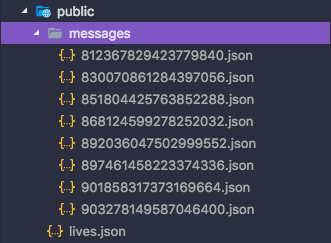

# 知乎 Live

> 使用 Puppeteer 爬取已购买知乎 Live 

## Getting Started

### 安装依赖

> *Note: 由于使用了大量 async/await Node 版本需要在 v7.6.0 以上*

```bash
yarn
```

> **Note**: Puppeteer 安装时会下载一个最新版本的 Chromium，可以通过设置环境变量或者 npm config 中的 PUPPETEER_SKIP_CHROMIUM_DOWNLOAD 跳过下载。详情：[Environment variables](https://github.com/GoogleChrome/puppeteer/blob/master/docs/api.md#environment-variables). 如果不下载的话，启动时可以通过 puppeteer.launch([options]) 配置项中的 executablePath 指定 Chromium 的位置。

```javascript
const browser = await puppeteer.launch({
  executablePath: './chrome/Chromium.app/Contents/MacOS/Chromium',
  headless: false
})
```

### 复制一份配置文件

```bash
cp .env.example .env
```

填写知乎的账号和密码

### 执行 Node.js 程序

```bash
node index.js
```

> **Note**: 首次登录需要手动过验证，成功后会保存 cookie 到本地



> *爬取成功后会将 Live 信息保存到本地 public 文件夹下*

## LICENSE

[MIT](./LICENSE)